# Ex.07 Restaurant Website
## Date:13.12.2024

## AIM:
To develop a static Restaurant website to display the food items and services provided by them.

## DESIGN STEPS:

### Step 1:
Requirement collection.

### Step 2:
Creating the layout using HTML and CSS.

### Step 3:
Updating the sample content.

### Step 4:
Choose the appropriate style and color scheme.

### Step 5:
Validate the layout in various browsers.

### Step 6:
Validate the HTML code.

### Step 7:
Publish the website in the given URL.

## PROGRAM:
```
restweb.html

<!DOCTYPE html>
<html lang="en">
<head>
    <meta charset="UTF-8">
    <meta name="viewport" content="width=device-width, initial-scale=1.0">
    <title>THE FILOXENIA SIPS</title>
    <link rel="stylesheet" href="styler.css">
</head>
<body>
    <header>
        <div class="logo-header">
            <div class="logo-text">
                <h1>THE FILOXENIA SIPS</h1>
            </div>
    	</div>
	<div class='toolbar'>
        <nav>
            <ul>
                <li><a href="home.html">Home</a></li>
                <li><a href="menu.html">Menu</a></li>
                <li><a href="administration.html">Administration</a></li>
                <li><a href="contact.html">Contact Us</a></li>
            </ul>
        </nav>
	</div>
    </header>
    <main>
        <section class="promo">
            <h2>Heavenly Combo, Perfectly Brewed Today!</h2>
            <h3>Americano + Croissant</h3>
        </section>
        <section class="info">
            <div class="card">
                
                <h4>Our New Menu</h3>
                <p>Enjoy bold coffees and indulge in our treats.</p>
                <a href="menu.html">See our new menu</a>
	
            </div>

            <div class="card">
                
                <h4>Book a table</h4>
                <p>Reserve your spot at Filoxenia Sips for a cozy and delightful experience. Book a table now and savor every moment with us!</p>
                <a href="book.html">Book your table now</a>
            </div>
            <div class="card">
                
                <h4>Opening Hours</h4>
                <p>Mon - Fri: 2pm - 10pm<br>Sat: 2pm - 11pm<br>Sun: 2pm - 9pm</p>
            </div>
        </section>
    </main>
    <div class="footer-content">
    <div class="footer-logo">
        
    </div>
    <div class="footer-line"></div>
</div>

    <footer>
        <p>Designed and Developed by <a href="#">Sushmitha Gembunathan</a></p>
    </footer>
</body>
</html>


styler.css

body {
    font-family: Arial, sans-serif;
    margin: 0;
    padding: 0;
    background-color: #ffffff;
    color: #FFFFFF;
}

.logo-header {
    background: url('Yamas-Texas.png') no-repeat center center/cover;
    height: 300px;
    display: flex;
    justify-content: center;
    align-items: center;
    text-align: center;
    color: white;
}


.logo-text h1 {
    font-family: 'serif';
    font-size: 5em;
    letter-spacing: 2px;
    text-shadow: 2px 2px 5px rgba(0, 0, 0, 0.7);
}


.toolbar {
    background-color: #333;
    padding: 10px 0;
}

.toolbar ul {
    list-style: none;
    margin: 0;
    padding: 0;
    display: flex;
    justify-content: center;
    align-items: center;
}

.toolbar li {
    margin: 0 15px;
}

.toolbar a {
    text-decoration: none;
    color: #fff;
    font-size: 1.1em;
    font-weight: bold;
}

.toolbar a:hover {
    text-decoration: underline;
}


.toolbar {
    border-radius: 10px 10px 10px 10px;
    box-shadow: 0 2px 5px rgba(0, 0, 0, 0.2);
}

.promo {
    background: url('food.png') no-repeat center center/cover;
    color: #fff;
    text-align: center;
    padding: -10px 20px;
    margin: 20px;
    border-radius: 10px;
    box-shadow: 0 4px 8px rgba(0, 0, 0, 0.2);
}

.promo h2 {
    font-size: 2.0em;
}

.promo h3{
    font: size 2.5em; 
}


.info {
    display: flex;
    justify-content: space-around;
    margin: 20px;
    gap: 10px;
}

.info .card {
    background-color: #194274;
    border-radius: 5px;
    box-shadow: 0 2px 5px #333(0, 0, 0, 0.2);
    overflow: hidden;
    text-align: center;
    padding: 35px;
    flex: 1;
}

.info .card img {
    width: 100%;
    height: auto;
}

.info .card h4 {
    color:#ffcc00;
    margin: 10px 0;
}

.info .card a {
    color: #FF0000;
    text-decoration: none;
}
.footer-content {
    display: flex;
    align-items: center;
    justify-content: center;
    margin-bottom: 20px;
}

.footer-logo img {
    width: 50px;
    height: auto;
    margin-right: 10px;
}

.footer-line {
    flex-grow: 1;
    height: 1px;
    background-color: #333;
    margin-right: 30px;
}
footer {
    text-align: center;
    padding: 10px 0;
    font-size: 0.9em;
    width: 100%;
    z-index: 1000;
}

.footer-border{
    width: 200px;
    height: 0.5px;
    background-color: #333;
    margin: 10px auto 5px auto;
    border-radius: 2px;
}

footer p{
    color:#333
}
 
footer a {
      text-decoration: none;
      color:#FF0000;
}

home.html

<!DOCTYPE html>
<html lang="en">
<head>
    <meta charset="UTF-8">
    <meta name="viewport" content="width=device-width, initial-scale=1.0">
    <title>Home (THE FILOXENIA SIPS)</title>
    <style>
        body {
            font-family: Arial, sans-serif;
            margin: 0;
            padding: 0;
            box-sizing: border-box;
        }
        .hero {
            background-image: url('Yamas-Texas.png');
            background-size: cover;
            background-position: center;
            color: white;
            text-align: center;
            padding: 80px 20px;
        }
        .hero h1 {
            font-size: 6em;
        }
        .hero p {
            font-size: 1.2em;
            margin: 20px 0;
        }
        .hero button {
            padding: 10px 20px;
            background-color: #ffda79;
            color: #333;
            border: none;
            border-radius: 5px;
            cursor: pointer;
            font-size: 1em;
        }
        .section {
            padding: 40px 20px;
            text-align: center;
        }
        .section h2 {
            font-size: 2em;
            margin-bottom: 20px;
        }
        .cards {
            display: flex;
            justify-content: center;
            gap: 20px;
            flex-wrap: wrap;
        }
        .card {
            background-color: #fff;
            border: 1px solid #ccc;
            border-radius: 10px;
            box-shadow: 0 2px 5px rgba(0,0,0,0.1);
            padding: 20px;
	    width: 250px; 
            text-align: center;
            display: flex;
            flex-direction: column;
            align-items: center;
        }
        .product-image {
            width: 100%;
            height: 150px; 
            object-fit: cover;
            border-radius: 10px;
           margin-bottom: 15px;
       }

       .card h3 {
    		margin: 10px 0 5px;
    		font-size: 1.2em;
	}
        footer {
            background-color: #333;
            color: white;
            text-align: center;
            padding: 20px;
            margin-top: 40px;
        }
    </style>
</head>
<body>
    <header class="hero">
        <h1>Home</h1>
        <p>Enjoy the finest coffee and pastries in town</p>
        <button>Learn More</button>
    </header>

    <section class="section">
        <h2>About Us</h2>
        <p>At Filoxenia Sips, we embrace the Greek tradition of Filoxenia, which means "hospitality" or "love for strangers." Inspired by this warm and welcoming spirit, we offer exceptional coffee, delicious treats, and a cozy atmosphere where every guest feels at home.Our cozy café offers a welcoming space to relax, enjoy handcrafted beverages, and indulge in freshly baked delights, all served with a smile.</p>
    </section>

    <section class="section">
        <h2>Our shop</h2>
        <div class="cards">
            <div class="card">
		
                <h3>Outdoor Dinning</h3>
            </div>
            <div class="card">
		
                <h3>Indoor Dinning</h3>
            </div>
            <div class="card">
		
                <h3>Art Station</h3>
            </div>
        </div>
    </section>

    <footer>
        <p>Designed and Developed by Sushmitha Gembunathan<p>
    </footer>
</body>
</html>

menu.html

<!DOCTYPE html>
<html lang="en">
<head>
    <meta charset="UTF-8">
    <meta name="viewport" content="width=device-width, initial-scale=1.0">
    <title>Menu(THE FILOXENIA SIPS) </title>
    <style>
        body {
            font-family: Arial, sans-serif;
            margin: 0;
            padding: 0;
            background-color: #f9f9f9;
            color: #333;
        }

        .hero {
            background-image: url('Yamas-Texas.png');
            background-size: cover;
            background-position: center;
            color: white;
            text-align: center;
            padding: 80px 20px;
        }
        .hero h1 {
            font-size: 3em;
        }

        .menu-container {
            display: flex;
            flex-wrap: wrap;
            justify-content: center;
            gap: 20px;
            padding: 40px;
        }

        .menu-item {
            background: white;
            border: 1px solid #ddd;
            border-radius: 8px;
            width: 300px;
            overflow: hidden;
            box-shadow: 0 2px 5px rgba(0, 0, 0, 0.1);
            text-align: center;
        }

        .menu-item img {
            width: 100%;
            height: 200px;
            object-fit: cover;
        }

        .menu-item h3 {
            margin: 15px 0 5px;
            font-size: 20px;
        }

        .menu-item p {
            font-size: 14px;
            color: #777;
            padding: 0 10px;
        }

        .menu-item .price {
            font-size: 18px;
            font-weight: bold;
            color: #ff5722;
            margin: 10px 0;
        }

        footer {
            background-color: #333;
            color: white;
            text-align: center;
            padding: 20px;
            margin-top: 40px;
        }

        footer a {
            color: #ffda79;
            text-decoration: none;
        }

        footer .footer-links {
            display: flex;
            justify-content: center;
            gap: 40px;
            margin: 20px 0;
            font-size: 14px;
        }

        footer .footer-links div {
            text-align: left;
        }

        footer .footer-links h4 {
            margin-bottom: 10px;
            font-size: 16px;
            color: #ffda79;
        }
    </style>
</head>
<body>
    <header class="hero">
        <h1>Menu</h1>
    </header>

    <div class="menu-container">
        <div class="menu-item">
            
            <h3>Americano</h3>
            <p>Dive into a smooth, bold espresso with the perfect touch of water – a satisfying sip that keeps you coming back for more.</p>
            <div class="price">SGD 2.70</div>
        </div>
        <div class="menu-item">
            
            <h3>Cheese cake</h3>
            <p>Indulge in creamy, velvety goodness with every bite – the sweet and tangy delight you’ve been craving.</p>
            <div class="price">SGD 3.30</div>
        </div>
        <div class="menu-item">
            
            <h3>Bubble Tea</h3>
            <p>Treat yourself to a fun, fruity experience with chewy bubbles in every sip – a playful burst of flavor.</p>
            <div class="price">SGD 3.75</div>
        </div>
        <div class="menu-item">
            
            <h3>Croissants</h3>
            <p>Flaky, buttery perfection that’s fresh out of the oven – the ultimate morning treat to start your day right.</p>
            <div class="price">SGD 2.25</div>
        </div>
        <div class="menu-item">
            
            <h3>Caramel Macchiato</h3>
            <p>Savor the sweet, comforting swirl of caramel and espresso, topped with smooth steamed milk – your perfect pick-me-up.</p>
            <div class="price">SGD 3.45</div>
        </div>
        <div class="menu-item">
            
            <h3>Lava cake</h3>
            <p>Experience the magic of rich, warm chocolate that oozes out with every bite – an irresistible indulgence.</p>
            <div class="price">SGD 4.20</div>
        </div>
        <div class="menu-item">
            
            <h3>Flatewhite coffee</h3>
            <p>Cozy up with a perfectly balanced espresso, lovingly swirled with creamy, velvety milk – comfort in every cup.</p>
            <div class="price">SGD 3.30</div>
        </div>
        <div class="menu-item">
            
            <h3>Glazed donuts</h3>
            <p>Sink into the soft, sweet layers of a perfectly glazed donut – a sugary delight that melts in your mouth.</p>
            <div class="price">SGD 1.80</div>
        </div>
        <div class="menu-item">
            
            <h3>Mocha</h3>
            <p>A heavenly blend of rich chocolate and espresso, topped with a creamy finish – your go-to for a sweet coffee escape.</p>
            <div class="price">SGD 3.45</div>
        </div>
        <div class="menu-item">
            
            <h3>Pancakes</h3>
            <p>Soft, fluffy stacks of happiness, drizzled with warm maple syrup – the breakfast of your dreams.</p>
            <div class="price">SGD 3.75</div>
        </div>
        <div class="menu-item">
            
            <h3>Coldbrew coffee</h3>
            <p>Cool, smooth, and bold – the refreshing pick-me-up that’s perfect for any time of day.</p>
            <div class="price">SGD 3.60</div>
        </div>
        <div class="menu-item">
            
            <h3>Macarons</h3>
            <p>Bite into delicate, colorful cookies with a creamy center that’ll leave you craving just one more.</p>
            <div class="price">SGD 2.70</div>
        </div>
    </div>

    <footer>
        <div class="footer-links">
            <div>
                <h4>Contact Us</h4>
                <p>123 Orchard Road, #05-12, Orchard Central, Singapore 238888</p>
                <p>contact@filoxeniasips.sg | +65 9123 4567</p>
            </div>
            <div>
                <h4>Our Links</h4>
                <p>About Us | FAQ | Team | Testimonial</p>
            </div>
            <div>
                <h4>Our Services</h4>
                <p>Table Service | Quick Delivery | Fresh Food</p>
            </div>
        </div>
        <p>Designed and Developed by Sushmitha Gembunathan</p>
    </footer>
</body>
</html>


administration.html

<!DOCTYPE html>
<html lang="en">
<head>
    <meta charset="UTF-8">
    <meta name="viewport" content="width=device-width, initial-scale=1.0">
    <title>ADMINISTRATION (THE FILOXENIA SIPS) </title>
    <style>
        body {
            font-family: Arial, sans-serif;
            margin: 0;
            padding: 0;
            background-color: #f9f9f9;
            color: #333;
        }

        .hero {
            background-image: url('Yamas-Texas.png');
            background-size: cover;
            background-position: center;
            color: white;
            text-align: center;
            padding: 80px 20px;
        }
        .hero h1 {
            font-size: 3em;
        }

        .staff-container {
            display: flex;
            flex-wrap: wrap;
            justify-content: center;
            gap: 20px;
            padding: 40px;
        }

        .staff-item {
            background: white;
            border: 1px solid #ddd;
            border-radius: 8px;
            width: 300px;
            overflow: hidden;
            box-shadow: 0 2px 5px rgba(0, 0, 0, 0.1);
            text-align: center;
        }

        .staff-item img {
            width: 100%;
            height: 200px;
            object-fit: cover;
        }

        .staff-item h3 {
            margin: 15px 0 5px;
            font-size: 20px;
        }

        .staff-item p {
            font-size: 14px;
            color: #777;
            padding: 0 10px;
        }

        .staff-item .position {
            font-size: 18px;
            font-weight: bold;
            color: #ff5722;
            margin: 10px 0;
        }
  	footer {
            background-color: #333;
            color: white;
            text-align: center;
            padding: 20px;
            margin-top: 40px;
        }

        footer a {
            color: #ffda79;
            text-decoration: none;
        }

        footer .footer-links {
            display: flex;
            justify-content: center;
            gap: 40px;
            margin: 20px 0;
            font-size: 14px;
        }

        footer .footer-links div {
            text-align: left;
        }

        footer .footer-links h4 {
            margin-bottom: 10px;
            font-size: 16px;
            color: #ffda79;
        }
    </style>
</head>
<body>
    <header class="hero">
        <h1>Administration</h1>
    </header>

    <div class="staff-container">
        <div class="staff-item">
            
            <h3>Madhur Jaffrey</h3>
            <p>Madhur Jaffrey is responsible for the overall success of the cafe. Think finances, legalities, marketing, and building a team.</p>
            <div class="position">Cafe Owner</div>
        </div>
        <div class="staff-item">
            
            <h3>Ranveer Brar</h3>
            <p>Ranveer Brar oversees all aspects of a café's operations. This includes: selling food and drinks, hiring and scheduling staff, menu planning, and maintaining inventory. </p>
            <div class="position">Manager</div>
        </div>
        <div class="staff-item">
            
            <h3>Aarti Lucica Sequeira</h3>
            <p>Aarti Lucica Sequeira is responsible for keeping track of revenue and expenses, to keep the business on budget and in profit.</p>
            <div class="position">Cafe Accountant</div>
        </div>
        <div class="staff-item">
            
            <h3>Vikas Khanna</h3>
            <p>Vikas Khanna is part of the team that makes up the kitchen staff in a cafe business. The chef can be a Sous chef or other type of chef. The key ingredient is that they manage the kitchen and oversee the dishes.</p>
            <div class="position">Executive Chef</div>
        </div>
        <div class="staff-item">
            
            <h3>Sushmitha Gembunathan</h3>
            <p>Sushmitha Gembunathan makes and serves beverages such as coffee, tea and specialty beverages. </p>
            <div class="position">Barista</div>
        </div>
        <div class="staff-item">
            
            <h3>Saransh Goila</h3>
            <p>Saransh Goila is responsible for taking orders, delivering food, and ensuring customer satisfaction.</p>
            <div class="position">Staff</div>
        </div>
    </div>    
    <footer>
        <div class="footer-links">
            <div>
                <h4>Contact Us</h4>
                <p>123 Orchard Road, #05-12, Orchard Central, Singapore 238888</p>
                <p>contact@filoxeniasips.sg | +65 9123 4567</p>
            </div>
            <div>
                <h4>Our Links</h4>
                <p>About Us | FAQ | Team | Testimonial</p>
            </div>
            <div>
                <h4>Our Services</h4>
                <p>Table Service | Quick Delivery | Fresh Food</p>
            </div>
        </div>
        <p>Designed and Developed by Sushmitha Gembunathan</p>
    </footer>
</body>
</html>


contact.html

<!DOCTYPE html>
<html lang="en">
<head>
    <meta charset="UTF-8">
    <meta name="viewport" content="width=device-width, initial-scale=1.0">
    <title>Contact Us (THE FILOXENIA SIPS)</title>
    <style>
        
        body {
            font-family: Arial, sans-serif;
            margin: 0;
            padding: 0;
            line-height: 1.6;
        }

       .hero {
            background-image: url('Yamas-Texas.png');
            background-size: cover;
            background-position: center;
            color: white;
            text-align: center;
            padding: 80px 20px;
        }
        .hero h1 {
            font-size: 3em;
        }

        nav {
            display: flex;
            justify-content: center;
            background-color: #333;
            padding: 10px 0;
        }

        nav a {
            color: white;
            text-decoration: none;
            margin: 0 15px;
            font-size: 1em;
        }

        nav a:hover {
            color: #ffda79;
        }

        .container {
            max-width: 1200px;
            margin: auto;
            padding: 20px;
        }

        h1 {
            text-align: center;
            margin-bottom: 20px;
        }
	
	.contact-image {
            display: block;
            margin: 0 auto 20px;
            max-width: 100%;
            height: auto;
            border-radius: 10px;
        }
        .contact-details,
        .contact-form {
            margin: 20px 0;
        }

        .contact-details p {
            font-size: 1.1em;
        }

        .contact-form {
            background-color: #f9f9f9;
            padding: 20px;
            border-radius: 5px;
            box-shadow: 0 2px 5px rgba(0, 0, 0, 0.1);
        }

        .form-group {
            display: flex;
            justify-content: space-between;
            gap: 20px;
            margin-bottom: 15px;
        }

        .form-group div {
            flex: 1;
        }

        input, textarea {
            width: 100%;
            padding: 10px;
            margin-top: 5px;
            border: 1px solid #ccc;
            border-radius: 5px;
            font-size: 1em;
        }

        textarea {
            resize: vertical;
            height: 100px;
        }

        button {
            display: block;
            width: 100%;
            background-color: #333;
            color: white;
            border: none;
            padding: 10px;
            font-size: 1.2em;
            border-radius: 5px;
            cursor: pointer;
        }

        button:hover {
            background-color: #555;
        }

        footer {
            text-align: center;
            padding: 10px;
            background-color: #333;
            color: white;
        }
    </style>
    <script>
        
        function validateForm(event) {
            event.preventDefault(); 
            const firstName = document.getElementById("first-name").value;
            const email = document.getElementById("email").value;
            const message = document.getElementById("message").value;

            if (!firstName || !email || !message) {
                alert("Please fill in all required fields.");
                return;
            }
            alert("Your message has been submitted. Thank you!");
        }
    </script>
</head>
<body>

    <header class="hero">
        <h1>Contact Us</h1>
    </header>

    <nav>
        <a href="#">Home</a>
        <a href="#">About</a>
        <a href="#">Menu</a>
        <a href="#">Contact</a>
    </nav>

    <div class="container">
        
        <div class="contact-details">
            <h2>Contact Information</h2>
            <p>Email: <a href="mailto:contact@filoxeniasips.sg">contact@filoxeniasips.sg</a></p>
            <p>Phone: +65 9123 4567</p>
            <p>Address: Orchard Road, #05-12, Orchard Central, Singapore 238888</p>
        </div>

        
        <div class="contact-form">
            <h2>Send Us a Message</h2>
            <form onsubmit="validateForm(event)">
                <div class="form-group">
                    <div>
                        <label for="first-name">First Name</label>
                        <input type="text" id="first-name" placeholder="Enter your first name">
                    </div>
                    <div>
                        <label for="last-name">Last Name</label>
                        <input type="text" id="last-name" placeholder="Enter your last name">
                    </div>
                </div>
                <div class="form-group">
                    <div>
                        <label for="email">Email</label>
                        <input type="email" id="email" placeholder="Enter your email">
                    </div>
                </div>
                <div>
                    <label for="message">Message</label>
                    <textarea id="message" placeholder="Write your message"></textarea>
                </div>
                <button type="submit">Send</button>
            </form>
        </div>
    </div>

    <footer>
        <p>Designed and Developed by Sushmitha Gembunathan</p>
    </footer>

</body>
</html>


book.html

<!DOCTYPE html>
<html lang="en">
<head>
    <meta charset="UTF-8">
    <meta name="viewport" content="width=device-width, initial-scale=1.0">
    <title>Reservation</title>
    <style>
        body {
            font-family: Arial, sans-serif;
            margin: 0;
            padding: 0;
            line-height: 1.6;
        }

        .hero {
            background-image: url('Yamas-Texas.png');
            background-size: cover;
            background-position: center;
            color: white;
            text-align: center;
            padding: 80px 20px;
        }
        .hero h1 {
            font-size: 3em;
        }

        nav {
            display: flex;
            justify-content: center;
            background-color: #333;
            padding: 10px 0;
        }

        nav a {
            color: white;
            text-decoration: none;
            margin: 0 15px;
            font-size: 1em;
        }

        nav a:hover {
            color: #ffda79;
        }

        .container {
            max-width: 1200px;
            margin: auto;
            padding: 20px;
        }

        h1 {
            text-align: center;
            margin-bottom: 20px;
        }

        .reservation-form {
            background-color: #f9f9f9;
            padding: 20px;
            border-radius: 5px;
            box-shadow: 0 2px 5px rgba(0, 0, 0, 0.1);
        }

        .form-group {
            display: flex;
            justify-content: space-between;
            gap: 20px;
            margin-bottom: 15px;
        }

        .form-group div {
            flex: 1;
        }

        label {
            font-weight: bold;
        }

        input, select, textarea {
            width: 100%;
            padding: 10px;
            margin-top: 5px;
            border: 1px solid #ccc;
            border-radius: 5px;
            font-size: 1em;
        }

        textarea {
            resize: vertical;
            height: 100px;
        }

        button {
            display: block;
            width: 100%;
            background-color: #333;
            color: white;
            border: none;
            padding: 10px;
            font-size: 1.2em;
            border-radius: 5px;
            cursor: pointer;
        }

        button:hover {
            background-color: #555;
        }

        footer {
            text-align: center;
            padding: 10px;
            background-color: #333;
            color: white;
        }
    </style>
    <script>
        
        function validateReservationForm(event) {
            event.preventDefault();
            const name = document.getElementById("name").value;
            const email = document.getElementById("email").value;
            const phone = document.getElementById("phone").value;
            const date = document.getElementById("date").value;
            const time = document.getElementById("time").value;
            const guests = document.getElementById("guests").value;

            if (!name || !email || !phone || !date || !time || !guests) {
                alert("Please fill in all required fields.");
                return;
            }
            alert("Your reservation has been successfully submitted. Thank you!");
        }
    </script>
</head>
<body>

    <header class="hero">
        <h1>Make A Reservation</h1>
    </header>

    <nav>
        <a href="index.html">Home</a>
        <a href="about.html">About</a>
        <a href="menu.html">Menu</a>
        <a href="contact.html">Contact</a>
        <a href="reservation.html">Reservation</a>
    </nav>

    <div class="container">
        <div class="reservation-form">
            <h2>Reserve a Table</h2>
            <form onsubmit="validateReservationForm(event)">
                <div class="form-group">
                    <div>
                        <label for="name">Name</label>
                        <input type="text" id="name" placeholder="Enter your name" required>
                    </div>
                    <div>
                        <label for="email">Email</label>
                        <input type="email" id="email" placeholder="Enter your email" required>
                    </div>
                </div>
                <div class="form-group">
                    <div>
                        <label for="phone">Phone Number</label>
                        <input type="tel" id="phone" placeholder="Enter your phone number" required>
                    </div>
                    <div>
                        <label for="date">Date</label>
                        <input type="date" id="date" required>
                    </div>
                </div>
                <div class="form-group">
                    <div>
                        <label for="time">Time</label>
                        <input type="time" id="time" required>
                    </div>
                    <div>
                        <label for="guests">Number of Guests</label>
                        <select id="guests" required>
                            <option value="">Select</option>
                            <option value="1">1</option>
                            <option value="2">2</option>
                            <option value="3">3</option>
                            <option value="4">4</option>
                            <option value="5">5</option>
                            <option value="6+">6+</option>
                        </select>
                    </div>
                </div>
                <div>
                    <label for="special-requests">Special Requests (optional)</label>
                    <textarea id="special-requests" placeholder="Any specific preferences or requests"></textarea>
                </div>
                <button type="submit">Submit Reservation</button>
            </form>
        </div>
    </div>

    <footer>
        <p>Designed and Developed by Sushmitha Gembunathan</p>
    </footer>

</body>
</html>


```

## OUTPUT:
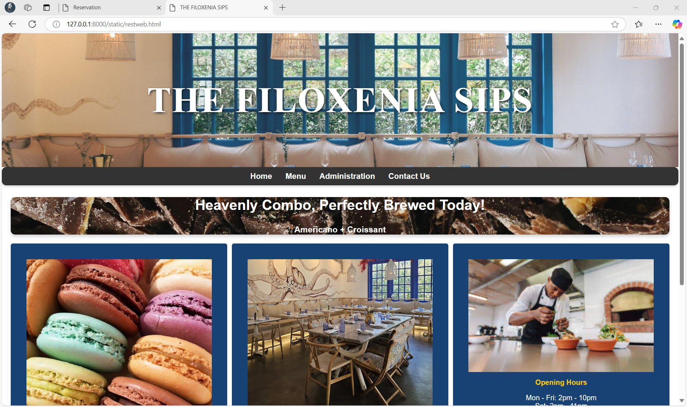
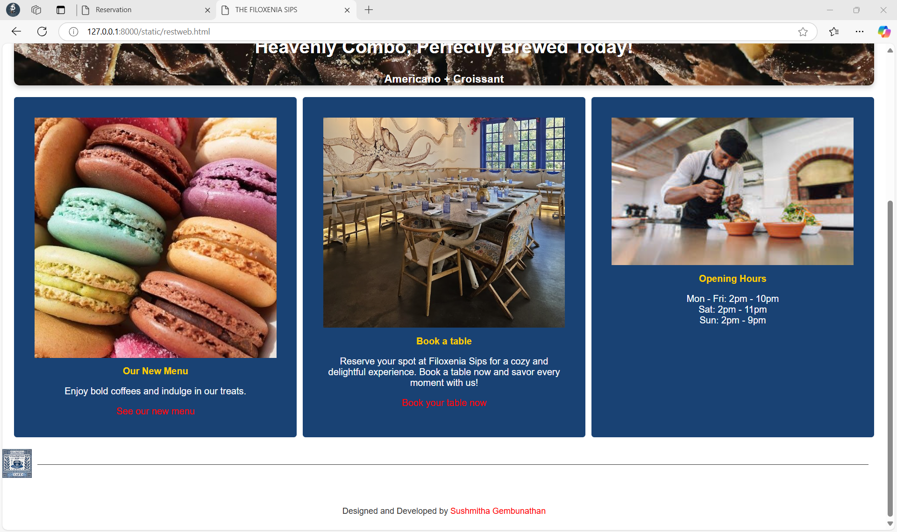
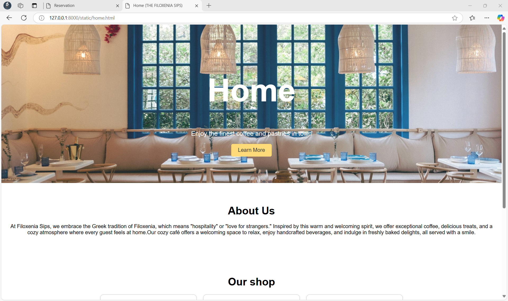
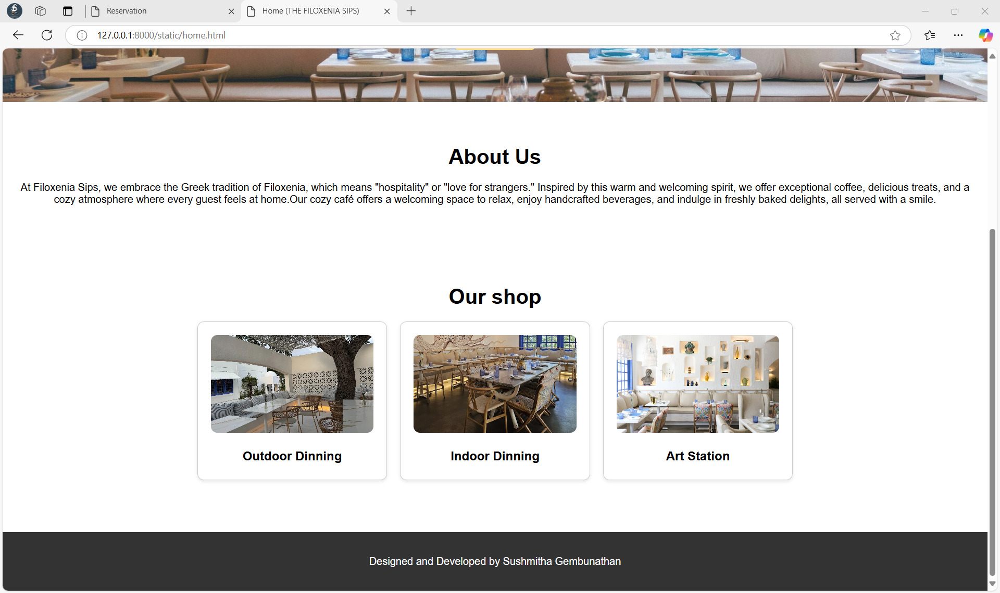
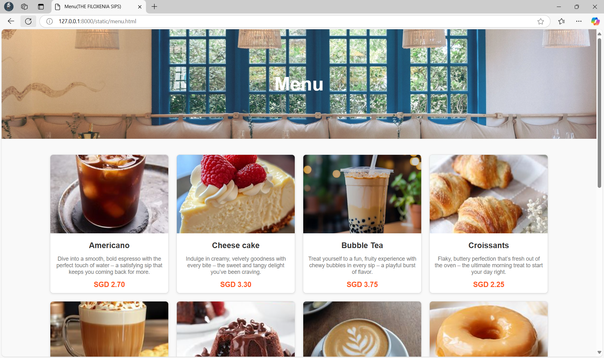
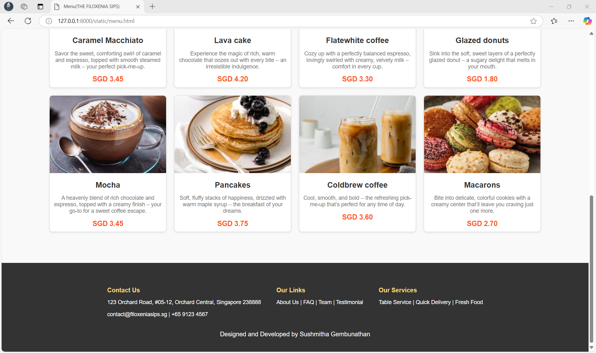
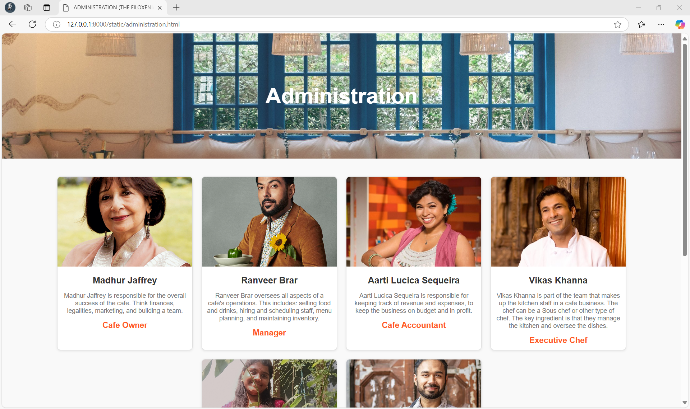
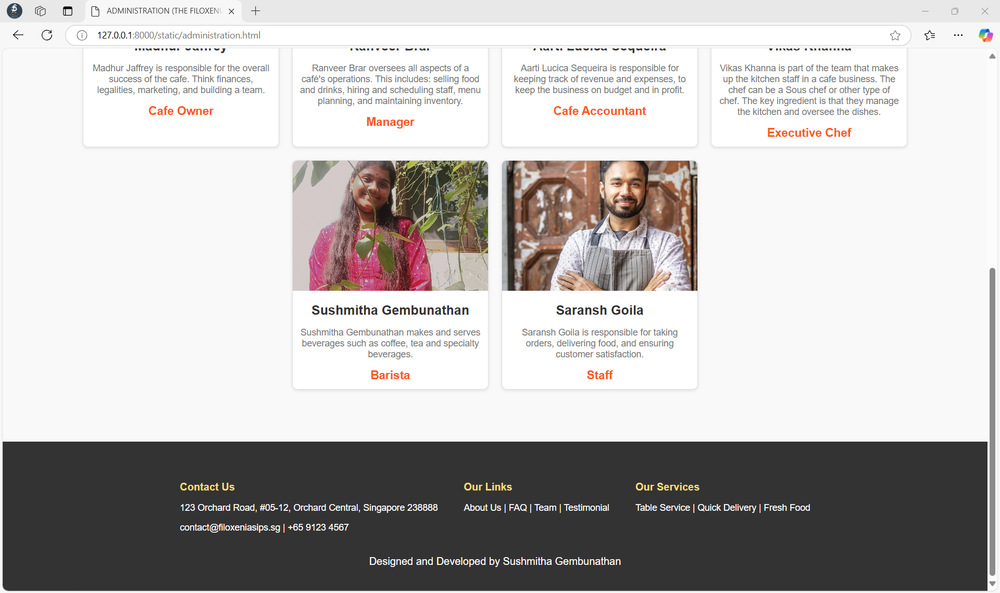
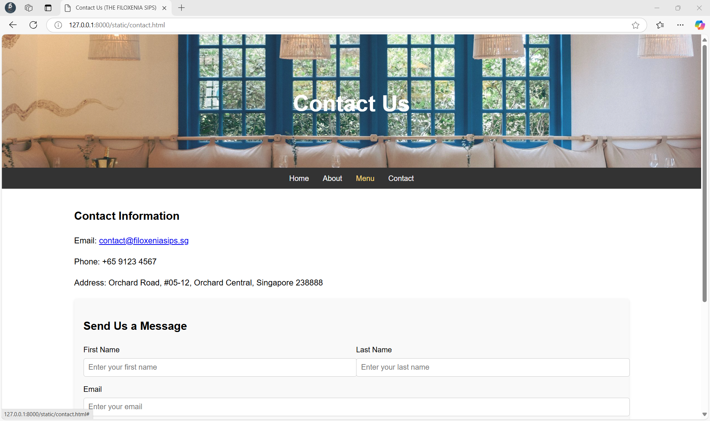
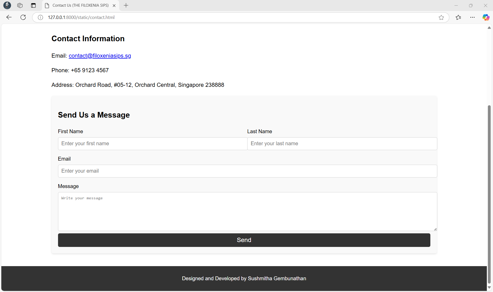
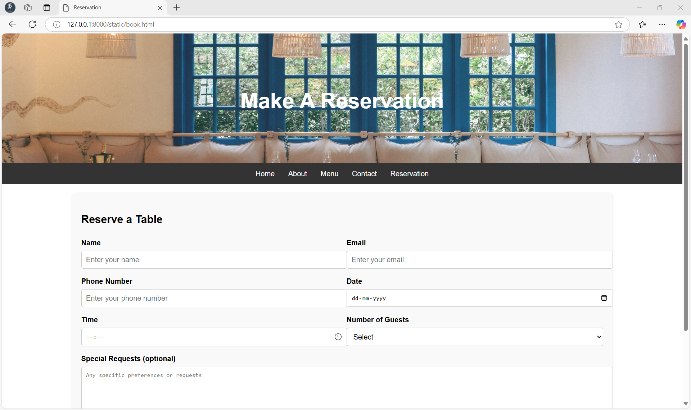
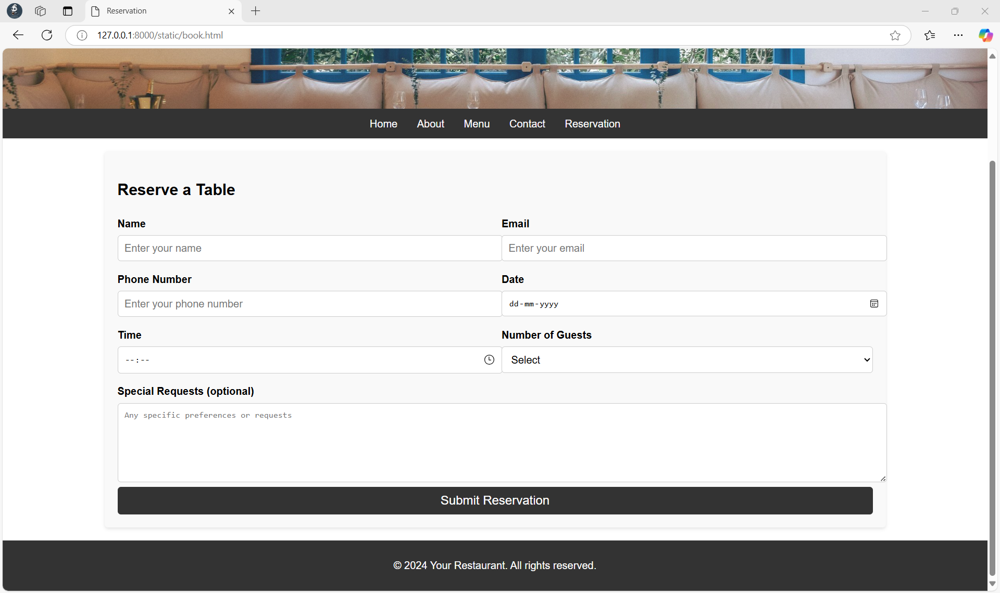

## RESULT:
The program for designing software company website using HTML and CSS is completed successfully.
